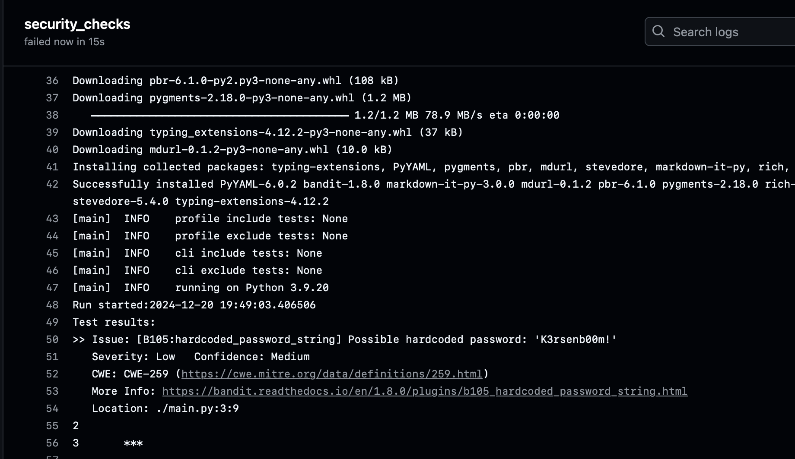

# Secure-Devops

## Link github repo

[Github repo](https://github.com/dietervanlombergen/secure-devops)

## Uitleg Github Actions

- Om de github Actions werkende te krijgen voeg je een Workflow toe.
    Met onderstaande code.
- Je zorgt voor een Ruleset op de branches die je wilt 'alle' in ons geval. In deze ruleset verplicht je de code om bepaalde checks door te gaan om gebruikt te kunnen worden. Deze configureer je hier:

- Dan voer je een pull request uit en kijk je of je code voldoet aan de checks gedefinieerd in de workflow

Ik zorgde voor een Dev Branch

**Workflow code**

## Failed pull request

In onderstaand screenshot kan je zien dat het pull request geweigerd werd omdat er plain text wachtwoorden aanwezig waren in de code. 

Bij de volgende screenshot kan je zien dat de safety check niet is doorgegaan. Dit komt omdat er een outdated versie van Flask gebruikt wordt. 

Bewijs dat een pulled request is gefailed en daardoor dus niet is doorgegaan

